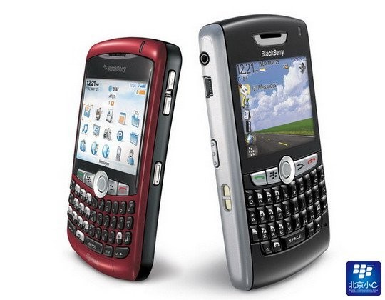
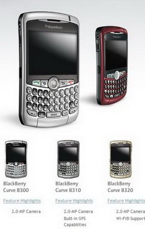
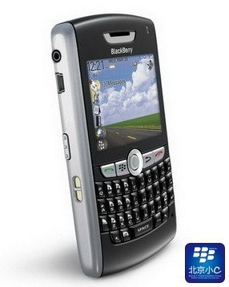

# 黑莓手机 8800 8820 8300 8310 8320的区别

## 前言

其实这个教程很早之前就应该写了，因时间原因一直没能更新，一直以来，所有购买中端机的客户都在问究竟黑莓手机Curve系列的83xx与88xx有什么区别，新手该如何选择，哪个型号性价比最高，哪个机器适合我用，根据上述情况，c2与c9总结了淘宝上所有客户的疑问，以客观分析的态度，完成了此篇文章，方便供大家购机前做参考。由于8830 8330这两个机型附带C网功能，短信无ucs2格式支持，不能发送中文信息且无解决办法，故这里不做评论。注：本文为北京小c博客原创，未经许可，不得转载，请尊重作者劳动成果！

让我们依次看下每个机型的特点以及与其他机型的对比(文章最后附带RIM官方发布的最全机型全方位表格对比，c2独家翻译)：

## 一、88xx与83xx系列的共同点

83系列和88系列应该是目前市场上比较受欢迎的BB低端机型。
那么今天，我们来对比下这几款型号的差别，来帮助大家依自己的需要，需求，来选购这些型号。

1. 同样搭载4.5OS。
2. 同样是2.4寸 320X240的分辨率。
3. 同样是轨迹球和全键盘。（这不废话吗）
4. 支持TFMicroSD内存卡扩展最大到8G。
5. 同样的CPU：312MHZ。

## 二、下面我们依次分析下两种不同系列的特征

①.黑莓BlackBerry Curve 83xx：

Curve83系列旗下有8300，8310，8320三款机器。

83曾一度是美国智能机销售排行榜的冠军。身为一个冠军当然是不无道理的。

Curve，顾名思义，就是曲线，所以83的全身就是圆滑有曲线的。握在手中手感非常不错。

相对88xx的优势：

1. 拥有200万的像素和3.5mm的耳机，可以说是一款娱乐与商务结合的手机。
2. 83系列一直以来如此受大家欢迎的原因是它的设计风格，曲线的风格搭载上全键盘，这是黑莓其他系列所没有的手感，并且曲线也就注定了它的外形不凡。小巧的身材，非常适合亚洲人的手感。

相对88xx的劣势：

1. 外放扬声器声音音质一般。
2. 键盘分散颗粒小且硬(比较适合小巧的手)。
3. 电池续航能力不如88xx。

其实83系列的3个型号的区别大家一定熟知了，下面的参数会告诉大家一切：

- 8300：无wifi无GPS。
- 8310：含GPS无wifi。
- 8320：含wifi无GPS。

②.黑莓BlackBerry 88xx：

88系列的就不如83那么旺盛了，旗下只有8800和8820。但在国内，88一直有与83抗衡让人无法取舍的魅力。

88就没有83那么有曲线的身板了。不过总体来说，更商务。比83更宽，但也更薄。

相对83xx的优势：

1. 键盘设计合理，很紧密并且软软的键盘令人感觉舒适。
2. 外放扬声器声音大且优质。
3. 无摄像头适合安全机构的人使用。
4. 电池续航能力超越83xx。

相当于83xx的劣势：

1. 无摄像头，无法满足日常拍照(虽然83xx的很鸡肋吧 呵呵)
2. 只有2.5mm的耳机孔，娱乐性能不如83系列

同83系列一样，两个型号的区别大家一定也很熟悉，不过我还是要重申一下：

- 8800：含GPS，不含WIFI
- 8820：含GPS以及WIFI

## 三、总结

1. 88xx和83xx系列的系统相同
2. 外观各有千秋
3. 娱乐是83xx的重点，商务应用是88xx的重点

总结对比下来，如果你不知道该如何选购。那么应该根据你自身需求来选择了：

比如你喜欢拍照，拍下身边的事物。那么83系列更适合你。

如果你是商务人士无需拍照功能，那么88系列是你独一无二的选择。

8800也是有GPS的，和8310不过差个摄像头和耳机而已。如果你既想拥有GPS又想有WIFI，那么8820就很不错了。

总之一切应该按照个人需要，从个人出发。从国内的目前形式上看，88系列普遍价格要低于83系列。

## 关于这四个机型的几个问题：

上面还是有些细节没写到，其实都是共同点，在表格里都可以完整的看到

提醒大家一下：RIM工厂由于是冲床设计，所以一些金属板上会有一定的划痕以及色泽不均匀，这些属于正常现象，详情请看如下链接：关于钢板有少量划痕的解释

购机前应提醒大家注意的低价机问题：本文为北京小c博客原创，未经许可，不得转载，请尊重作者劳动成果！

市场上无论是什么型号，都有廉价机，就如83XX的飞线孔机一样。

一分钱一分货。不要以为高端机就没有孔机。我曾经就目睹过一批1700价格的8900，成色是一塌糊涂的，如果仅是成色问题，我们会购入己用。可惜，随便的几个问题就知道这主板是垃圾主板。

打个比方，就如你问：拔电池时间会完全回归出厂吗？答：会。

那么你想，主板上的时间备用电池都没了，这是什么主板呢？

当然，这只是一个小小比方而已。对于价格这东西，请大家仔细对比下国外官方网站的价格，其实你觉得你买了便宜的，占了大便宜，殊不知真正的JS们赚的比你多，在偷笑……

**附录**：黑莓BlackBerry官方网站发布的四机型详细对比说明(Powered by C2 翻译&整理)

<table>
<tbody>
  <tr><td>&nbsp;</td><td> BlackBerry Curve 83xx</td><td> BlackBerry 88xx</td></tr>
  <tr><td>E-mail</td><td>支持</td><td>支持</td></tr>
  <tr><td>浏览器</td><td>支持</td><td>支持</td></tr>
  <tr><td>摄像头</td><td>支持</td><td>支持</td></tr>
  <tr><td>录制视频</td><td>支持</td><td>支持</td></tr>
  <tr><td>黑莓地图</td><td>支持</td><td>支持</td></tr>
  <tr><td>媒体播放器</td><td>支持</td><td>支持</td></tr>
  <tr><td>SMS/MMS</td><td>支持</td><td>支持</td></tr>
  <tr><td>GPS</td><td>仅8310支持</td><td>支持</td></tr>
  <tr><td colSpan=3><strong>尺寸和重量</strong></td></tr>
  <tr><td>长度</td><td>4.20″/107mm</td><td>4.49″/114mm</td></tr>
  <tr><td>宽度</td><td>2.36″/60mm</td><td>2.60″/66mm</td></tr>
  <tr><td>厚度</td><td>0.60″/15.5mm</td><td>0.55″/14mm</td></tr>
  <tr><td>重量</td><td>3.87oz/109.9g</td><td>4.73oz/134g</td></tr>
  <tr><td colSpan=3><strong>数据输入/导航键</strong></td></tr>
  <tr><td>触摸板</td><td>不支持</td><td>不支持</td></tr>
  <tr><td>轨迹球</td><td>支持</td><td>支持</td></tr>
  <tr><td>键盘</td><td>支持</td><td>支持</td></tr>
  <tr><td>键盘背景灯</td><td>支持</td><td>支持</td></tr>
  <tr><td colSpan=3><strong>语音输入/输出</strong></td></tr>
  <tr><td>3.5mm耳机支持</td><td>支持</td><td>不支持</td></tr>
  <tr><td>内置MIC/扬声器</td><td>支持</td><td>支持</td></tr>
  <tr><td>蓝牙支持(支持传输文件)</td><td>支持</td><td>支持</td></tr>
  <tr><td colSpan=3><strong>媒体播放器</strong></td></tr>
  <tr><td>视频格式支持</td><td>AVI,H.263,WMV</td><td>AVI,H.263,WMV</td></tr>
  <tr><td>音频格式支持</td><td>MP3,MIDI,AMR,AAC,WMA</td><td>MP3,MIDI,AMR,AAC,WMA</td></tr>
  <tr><td colSpan=3><strong>显示屏</strong></td></tr>
  <tr><td>分辨率</td><td>320\*240</td><td>320\*240</td></tr>
  <tr><td>TFT LCD</td><td>支持</td><td>支持</td></tr>
  <tr><td>可自定义字体大小</td><td>支持</td><td>支持</td></tr>
  <tr><td>背景光</td><td>支持</td><td>支持</td></tr>
  <tr><td>自动光感应</td><td>支持</td><td>支持</td></tr>
  <tr><td colSpan=3><strong>铃音/震动</strong></td></tr>
  <tr><td>MIDI格式</td><td>支持</td><td>支持</td></tr>
  <tr><td>MP3格式</td><td>支持</td><td>支持</td></tr>
  <tr><td>振动模式</td><td>支持</td><td>支持</td></tr>
  <tr><td>LED提醒模式</td><td>支持</td><td>支持</td></tr>
  <tr><td colSpan=3><strong>电池续航能力</strong></td></tr>
  <tr><td>待机(实测)</td><td>3天</td><td>4天</td></tr>
  <tr><td>通话时长</td><td>2小时</td><td>3小时</td></tr>
  <tr><td>MicroSD扩展</td><td>最大8g</td><td>最大8g</td></tr>
  <tr><td>本机内存</td><td>不支持</td><td>不支持</td></tr>
  <tr><td>内存(程序空间)</td><td>64MB</td><td>64MB</td></tr>
  <tr><td colSpan=3><strong>Modem</strong></td></tr>
  <tr><td>无线猫</td><td>支持</td><td>支持</td></tr>
  <tr><td colSpan=3><strong>无线网络</strong></td></tr>
  <tr><td>WIFI802.11b/g</td><td>仅8320支持</td><td>仅8820支持</td></tr>
  <tr><td>WIFI802.11a</td><td>仅8320支持</td><td>仅8820支持</td></tr>
  <tr><td>双频段CDMA1x</td><td>不支持</td><td>不支持</td></tr>
  <tr><td>850mhz/1900mhz GSM/gprs/EDGE</td><td>支持</td><td>支持</td></tr>
  <tr><td>2100MHzUMTS/HSPA</td><td>不支持</td><td>不支持</td></tr>
</tbody>
</table>
