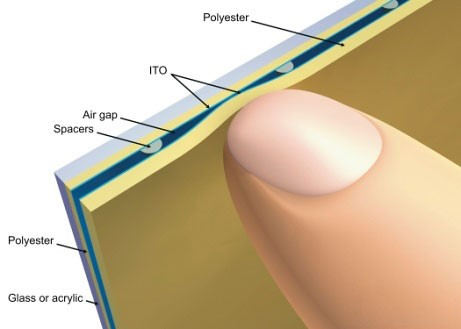

关于5800和iPhone的触屏不得不说的秘密

看大家两天来对5800的软件式多点触控很感兴趣，本人搜集了一些资料，对5800和iPhone的触控技术做以对比。

首先我们要知道5800和iPhone使用的是两种不同的工作原理。

5800采用的是电阻式触摸屏，利用压力感应进行控制的，而iPhone采用的电容式触摸屏，通过人体的感应电流来工作。

电阻式触摸屏的构成是显示屏及一块与显示屏紧密贴合的电阻薄膜屏。这个电阻薄膜屏通常分为两层，一层是由玻璃或有机玻璃构成的基层，其表面涂有透明的导电层；基层外面压着我们平时直接接触的经过硬化及防刮处理的塑料层，塑料层内部同样有一层导电层，两个导电层之间是分离的。当我们用手指或其他物体触摸屏幕的时候，两个导电层发生接触，电阻产生变化，控制器则根据电阻的具体变化来判断接触点的坐标并进行相应的操作。

而iPhone则采用的是电容式触摸屏，它是通过人体的感应电流来进行工作的。

普通电容式触摸屏的感应屏是一块四层复合玻璃屏，玻璃屏的内表面和夹层各涂有一层导电层，最外层是一薄层矽土玻璃保护层。当我们用手指触摸在感应屏上的时候，人体的电场让手指和和触摸屏表面形成一个耦合电容，对于高频电流来说，电容是直接导体，于是手指从接触点吸走一个很小的电流。这个电流分从触摸屏的四角上的电极中流出，并且流经这四个电极的电流与手指到四角的距离成正比，控制器通过对这四个电流比例的精确计算，得出触摸点的位置。

电容式触摸屏与传统的电阻式触摸屏有很大区别。电阻式触控屏幕在工作时每次只能判断一个触控点，如果触控点在两个以上，就不能做出正确的判断了，所以电阻式触摸屏仅适用于点击、拖拽等一些简单动作的判断。而电容式触摸屏的多点触控，则可以将用户的触摸分解为采集多点信号及判断信号意义两个工作，完成对复杂动作的判断。 电容式触摸屏也有以下几个缺点：1.精度不高。2.易受环境影响。3.成本偏高。

大多数情况下，这些系统都能正确探测到触摸的精确位置。但如果您试着同时触摸屏幕的好几个地方，结果就可能出错。有些屏幕只能对您第一次触摸到的地方作出反应。还有些屏幕可以同时探测到好几处触点，但软件无法计算出每次触摸的精确位置。其原因如下：

- 很多系统沿着轴线或者某个特定的方向探测变化，而不是探测屏幕的每个点。
- 有些触摸屏用系统内触点的平均值来探测触摸位置。
- 有些系统在测量时首先建立一道基线，当您触摸屏幕时，您的触摸产生了一道新的基线。所以如果同时触摸多处就会导致系统使用错误的基线作为起点进行测量。

以下引用Discovery旗下网站原创文章对iPhone触摸原理的解析，我们通过对比发现目前通过软件5800不可能达到iPhone多点触控的高度。

为了能让用户输入多触点的命令，iPhone对已有技术做出了全新改进。和其它很多触摸屏一样，它的触摸屏含有一层电容材料。但是iPhone 的电容器是根据一个坐标系来设计的。电容器的电路能够感应到沿线各点所发生的变化。也就是说，所有的点在被触摸时都能生成自己的信号，然后将信号传送给iPhone 的处理器。这使得iPhone能够确定在多个点同时发生触摸的位置和运动方向。由于iPhone是依靠电容材料来工作的，因此您必须用手指去触摸它，用触控笔或者带着手套去触摸它都是无法操作的。

**互耦合电容式触摸屏包括了一排的驱动线和一排的检测线**  

互电容触摸屏包含一个由传感线路和驱动线路组成的坐标系，以确定用户触摸了什么地方。

**自耦合电容式传感器检测到包括检测电路和电极**  

自电容屏幕包含传感电路和电极，以确定用户触摸了什么地方。

iPhone的触摸屏使用互电容或自电容来探测触摸位置。互电容中，电容电路需要两层不同的材料，一层含有携带电流的驱动线路，一层含有传感线路，用于探测在节点的电流。自电容使用一层单独的电极，与电容感应电路相连。这两种方法都可以将触摸数据发送成电脉冲。

## iPhone处理器

想让触摸屏正确分析输入数据，iPhone的处理器和软件至关重要。电容材料会将原始触摸位置数据传送给iPhone的处理器。处理器使用iPhone内存储的软件将原始数据转化为命令和动作。下面是转换过程：

1. 信号以电脉冲的形式从触摸屏传送到处理器。
2. 处理器使用软件分析数据，确定每次触摸是为了使用什么功能。这一过程包含确定屏幕上被触摸的区域大小、形状和位置。如果有必要，处理器会将相似的触摸整理分组。如果用户移动手指，处理器就会计算用户触摸的起点和终点间的差别。  

3. 处理器使用动作转换软件来确定用户的动作指令。它将用户的手指运动与用户在使用哪种应用程序的信息、用户触摸屏幕时应用程序在做什么联系起来。
4. 处理器将用户的指令传送给使用中的程序。如果有必要的话，它还会将命令发送给iPhone的屏幕和其它硬件。如果原始数据与任何有用的动作或命令都不相符的话，iPhone会认为这是一次无效触摸。  

所有上述步骤都是在瞬间发生的——您在触摸屏上输入后，马上就能看见屏幕发生了变化。这样，您只需要用手指发出指令，就可以打开并使用iPhone的所有应用程序。
