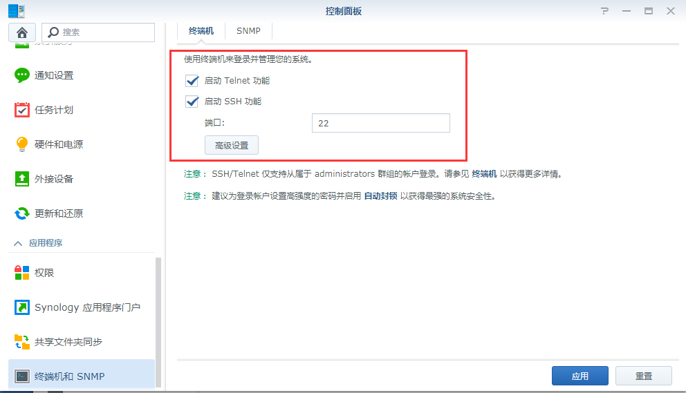
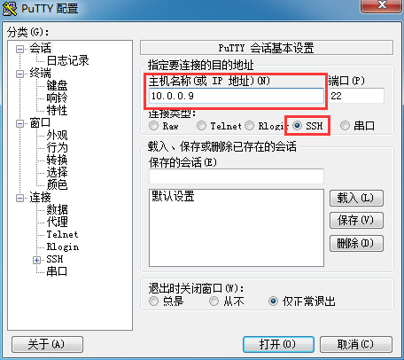
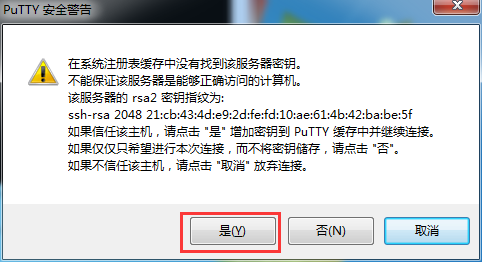
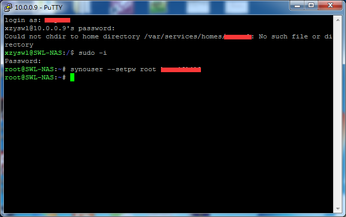
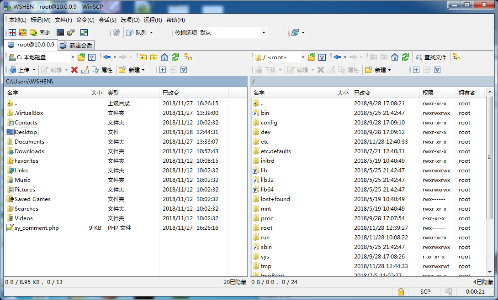

# 群晖DSM开启ROOT权限及WinSCP使用ROOT登录

群晖DSM6.0以后就封锁了ROOT权限登录，导致无法使用WinSCP使用root登录修改文件（使用admin账号是没有权限的）。

本文以群晖DSM6.1.7（以下简称DSM）为例：

## 一、准备工具

1、[PuTTY](_v_attachments/20200204193813714_22758/PuTTY.7z)

2、[WinSCP](_v_attachments/20200204193813714_22758/WinSCP.7z)

## 二、DSM开启SSH

DSM的“控制面板” ---> “终端机和SNMP” ，勾上“启动Telnet功能”和“启动SSH功能”的勾，然后点击“应用”

## 三、开启ROOT账号和修改密码

### 1、使用putty连接DSM

主机名称填写群晖的ip地址，端口是22，连接类型是SSH，点击“打开”，会报密匙对话框，点击“是”

### 2、配置root账号

login as：输入admin账号。就是当时第一次配置DSM输入的账号。输入admin的密码。（输入完按回车）

登录成功后，输入sudo -i

会提示输入密码password，这边还是输入admin密码。

看到root@……：~#这样的信息就是已经进入到root账号了。

设置root账号密码，输入synouser --setpw root password 这里的password最好和admin密码一样，这样不容易搞错。

### DSM 6.2还需要做以下操作：

1、输入vi /etc/ssh/sshd_config 修改ssh配置文件，按i键进入insert模式，修改#PermitRootLogin prohibit-password 为 PermitRootLogin yes，然后按ESC键输入:wq保存退出

2、输入reboot重启DSM

## 四、WinSCP连接DSM

文件协议选择SCP，主机名是DSM的ip地址，端口号还是22，用户名是root，密码是刚才设置的密码，点击“登录”，可能会跳出密匙，点击是即可。

这时候可以通过WinSCP使用ROOT账号对DSM文件进行修改了。

---
via: http://www.myxzy.com/post-81.html
