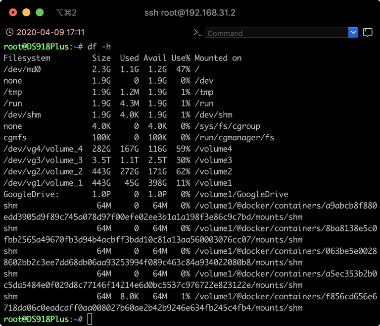

# 群晖NAS挂载Google Drive共享云端硬盘（团队盘）

rclone 是一个的命令行工具，支持在不同对象存储、网盘间同步、上传、下载数据。支持多种国外主流网盘比如 Google Drive、 OneDrive、BOX、AWS S3 等。

最近折腾在群晖 NAS 里使用 rclone 挂载 Google Drive 无限容量的共享云端硬盘（团队盘），反复失败最后发现是代理问题。

**rclone 并不会走系统（群晖）的全局代理，需要在当前终端中设置梯子的 HTTP 代理才能顺利挂载 Google Drive。**

```
export HTTP_PROXY=http://127.0.0.1:1087;
export HTTPS_PROXY=http://127.0.0.1:1087;
```

实现挂载的方案有两种：

1.  使用官方 rclone ，配置群晖的开机启动脚本；
2.  使用 docker 版 rclone，设置自动重新启动。

---

## 方法 1：使用官方 rclone 进行配置（推荐使用）

使用 root 用户登录群晖 SSH，设置代理

安装 rclone：

    curl https://rclone.org/install.sh | sudo bash

然后配置 rclone：

    rclone config

按照提示完成操作，最后得到 rclone.conf 配置文件。安装配置教程参考：<https://p3terx.com/archives/rclone-installation-and-configuration-tutorial.html>

配置完成后执行 `rclone config file` 得到配置文件 rclone.conf 的路径留用，或使用 cp 命令复制到比如 `/volume1/homes/admin/Rclone` 目录下。

在群晖控制面板里新增共享文件夹 `GoogleDrive` 作为挂载目录，去除勾选“使用回收站”，否则可能会报目录不为空的错误。

尝试执行下面的命令启动 rclone，确保已经在前一步对当前终端设置了 HTTP 代理。

```
rclone --config=/volume1/homes/admin/Rclone/rclone.conf mount GoogleDrive: /volume1/GoogleDrive --allow-other --allow-non-empty --buffer-size 32M --vfs-read-chunk-size=32M --vfs-read-chunk-size-limit 2048M --vfs-cache-mode writes --dir-cache-time 96h --daemon
```

`--config` 字段为配置文件 rclone.conf 的绝对路径；
`GoogleDrive: /volume1/GoogleDrive`，中 `GoogleDrive` 为新建 rclone 配置时设置的 `name` 字段，冒号后面留空默认为云盘根目录，`/volume1/GoogleDrive` 为前面新建的挂载目录的绝对路径。

使用 `df -h` 命令查看当前挂载的卷，出现 GoogleDrive: 显示大小为 1.0P 代表挂载成功，实际无限容量。

打开 File Station 应用即可查看 GoogleDrive 目录。

  
*`df -h` 查看当前挂载卷*

群晖设置开机启动：  
控制面板，任务计划，新增，触发的任务，用户自定义的脚本，默认开机事件，运行命令填写，文件为开机启动脚本绝对路径 ：

    bash /volume1/homes/admin/Rclone/GoogleDrive.sh

开机启动脚本：（均需要使用绝对路径）

```
#!/bin/bash
export HTTP_PROXY=http://127.0.0.1:1087;
export HTTPS_PROXY=http://127.0.0.1:1087;
/usr/bin/rclone --config=/volume1/homes/admin/Rclone/rclone.conf mount GoogleDrive: /volume1/GoogleDrive --allow-other --allow-non-empty --buffer-size 32M --vfs-read-chunk-size=32M --vfs-read-chunk-size-limit 2048M --vfs-cache-mode writes --dir-cache-time 96h --daemon
sleep 10s
df -h
```

---

## 方法 2：使用 docker 版，支持设置代理

使用方法 2 需要有可用的 rclone.conf 配置文件。参考方法 1

一开始苦于代理的问题，方向一度转移成 docker 方案。官方 docker 镜像设置了 `ENTRYPOINT` 为 `rclone`，无法预先执行代理设置命令，而且文档支持有限，实际问题也很多很迷。遂另寻它法，找到了另一个 docker 镜像，在它的基础上加入了代理设置方案。

Github 地址：[https://github.com/gqbre/docker-rclone-proxy](https://github.com/gqbre/docker-rclone-proxy)

使用 root 用户登录群晖 SSH，执行下面的命令新建 docker 容器

```
docker run -d --name docker-rclone-proxy --restart=always --cap-add SYS_ADMIN --device /dev/fuse --security-opt apparmor:unconfined -e RemotePath="GoogleDrive:" -e MountCommands="--allow-other --allow-non-empty --buffer-size 32M --vfs-read-chunk-size=32M --vfs-read-chunk-size-limit 2048M --vfs-cache-mode writes --dir-cache-time 96h" -e Proxy="true" -e ProxyTarget="172.17.0.1" -v /volume1/homes/admin/Rclone:/config -v /volume1/GoogleDrive:/mnt/mediaefs:shared gqbre/docker-rclone-proxy
```

可选代理配置 `-e Proxy="true" -e ProxyTarget="172.17.0.1" -e ProxyPort="1087"`， 其中 `ProxyTarget` 设置为提供代理的地址，我是群晖 docker 在 `host` 网络模式下跑 `v2ray` 做的梯子 ，地址 `172.17.0.1` 为群晖（Linux）下容器访问宿主主机的地址，即群晖自身的 `localhost/127.0.0.1`。

除非你使用宿主网络模式 `--network host` 启动 docker 容器，否则不要使用 `localhost/127.0.0.1`，它访问的是 docker 容器内部的回环地址。

`/volume1/homes/admin/Rclone` 为 rclone.conf 配置文件所在的**目录**；  
`:shared` 为挂载参数，如果遇到挂载参数错误、`linux mounts: path xx is mounted on xx but it is not a shared mount`、`Docker API 失败`等问题时，先执行下面的命令再执行 `docker run`：

    sudo mount --make-shared /volume1

`/volume1` 为你本地挂载目录 `GoogleDrive` 所在的主卷。

执行 `docker run` 后会返回容器 ID，群晖 DSM 界面的 Docker 客户端会出现一个名为 `docker-rclone-proxy` 的新容器。

PS. **不要**在 DSM 的 Docker 客户端上编辑此 docker 容器的任何设置，否则大概率会造成容器损坏，因为群晖的 docker 实现并不完整。

群晖设置开机启动：  
此容器设置了自动重启，方便实现开机自动挂载。但是群晖下应（基）该（本）需要先执行 `mount --make-shared` ，这降低了 docker 方法挂载的方便性，还需要通过任务计划设置开机启动，参考方法 1 。

开机启动脚本：（需要保留前面生成的容器）

    mount --make-shared

---

在实际使用过程中，重启系统后会遇到在 File Station 应用用无法看到 GoogleDrive 目录或者目录为空但实际已经挂载成功（通过 SMB 连接查看）的情况。

此时需要打开群晖控制面板点击共享目录即可，甚至点开 Docker 客户端或者连接一下 SMB 服务都行，理由大概是会刷新一下挂载卷？真玄学操作，而方法 1 启动脚本最后的 `df -h` 用途其实就是这个。

**推荐使用方法 1，无需干预即可实现自动挂载。**本文同样也适用于挂载 OneDrive，去掉代理就行了，毕竟巨硬交了保护费。

Google Drive 共享云端硬盘（团队盘）申请：<https://wangdalao.com/1949.html>

Rclone 操作参考：<https://p3terx.com/archives/rclone-advanced-user-manual-common-command-parameters.html>

---
via: http://www.sheyilin.com/2020/04/docker-rclone-proxy/