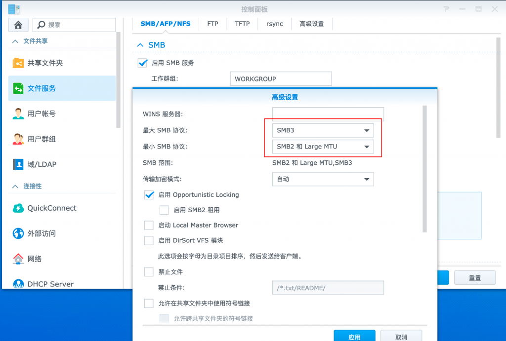
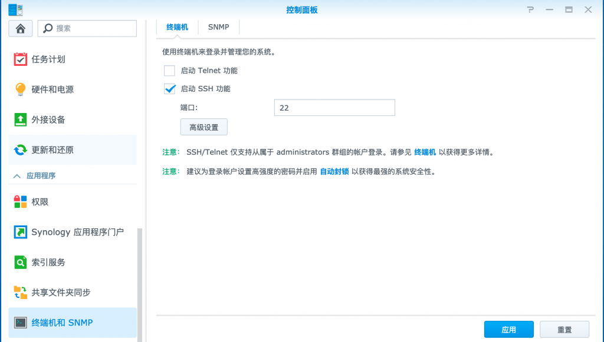
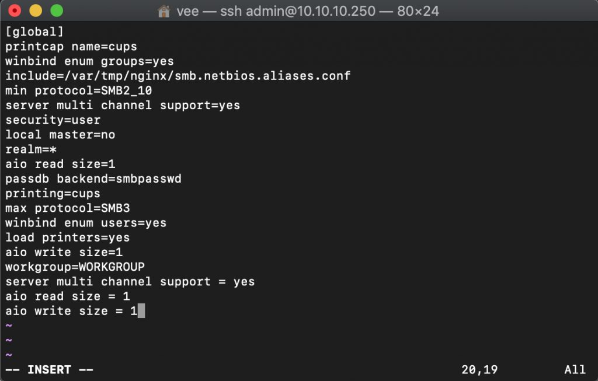
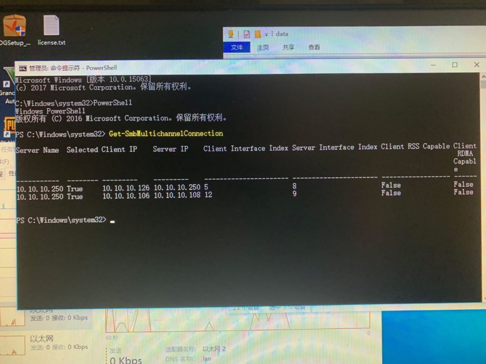

# 群晖开启SMB3，Windows下多通道叠加网卡速度

## 一、必要条件

<font color="ff0000">群晖和Windows电脑都需要至少每个设备要有两个网口。</font>

## 二、设置

1\. 打开控制面板，依次进入：文件服务-高级设置，将最大协议改为 SMB3，点击应用。



2\. 进入：终端机和 SNMP，勾选启动 SSH 功能，点击应用。



3\. 使用 PUTTY 等软件登入群晖 SSH。

```bash
sudo -s
vi /etc/samba/smb.conf
```

4\. 在文件末尾添加以下内容，完成后按 ESC，并输入 `:wq` 保存退出。

```
server multi channel support = yes
aio read size = 1
aio write size = 1
```



5\. 重启群晖，PC 和交换机，所有设置完成，在重启完成后，PC 端使用主机名（如`\\homeshare`）或 ip 进入一次共享，即可自动启用 SMB3 多通道了

## 三、检查是否开通成功

运行–以管理员身份启动CMD，然后在里面输入,看到双通道说明成功

```
PowerShell
Get-SmbMultichannelConnection
```

