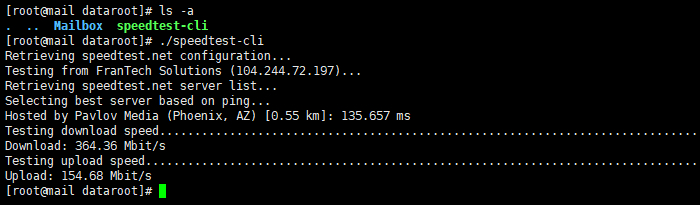
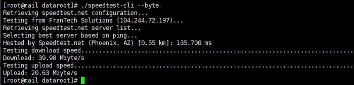
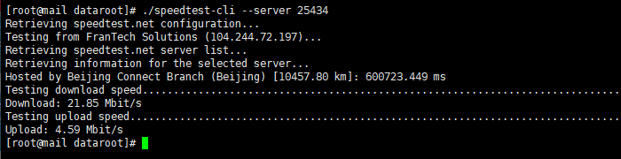
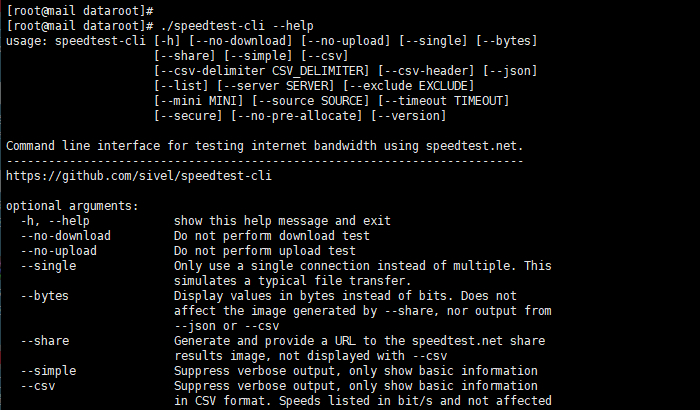

# 使用Speedtest工具测试VPS网速

VPS 一个重要指标就是其互联网速度，测试其网速多种多样，Speedtest 因为其准确直观，不失为一种好的方案。但是，如果 VPS 机器没有图形界面，是不是就不能使用 Speedtest 了呢？这当然不是，因为 Speedtest 针对使用命令行的 Linux 用户，专门发布了一个命令行工具 speedtest-cli，这是一个使用 Python 语言编写的脚本，专门用于 VPS 网速测试。

## 1] 下载并授权 speedtest-cli 工具

首先下载 speedtest-cli 工具并为其添加可执行权限：

```bash
# wget -O speedtest-cli https://raw.githubusercontent.com/sivel/speedtest-cli/master/speedtest.py
# chmod +x speedtest-cli
```

## 2] 执行speedtest-cli命令进行网速测试

工具下载好，并授权成功后，就可以执行 speedtest-cli 脚本进行网速测试了：

    # ./speedtest-cli

该工具不需要带任何参数即可执行，脚本会自动根据 ping 值选择最近的节点进行测试：




## 3] speedtest-cli 高级应用

所谓高级应用，就是在使用该工具时添加一些参数，可以达到更精细测试的目的。

首先，如果想让测试结果以”bytes”为单位，而不是默认的”bits”，则使用如下参数：

    # ./speedtest-cli --byte



其次，如果想看一下所有 speedtest.net 可用的服务器，可以使用以下命令：

    # ./speedtest-cli --list

当然，可以通过”grep”命令进行筛选，例如查看位于北京的节点：

    ./speedtest-cli --list | grep Beijing


知道了测试节点信息后，就可以指定节点进行测速了：

    # ./speedtest-cli --server No_OF_Server

使用时，直接用节点的数字来指定服务器即可。



最后，就是使用”–help”参数，查看 speedtest-cli 的详细参数信息，有兴趣的话可以自行测试每个参数的作用，这里就不再做过多讲解。

    # ./speedtest-cli --help


