# Docker入门实战

## I. Docker

### 简介

Docker是一种新兴的虚拟化技术，能够一定程度上的代替传统虚拟机。不过，Docker 跟传统的虚拟化方式相比具有众多的优势。我也将Docker类比于Python虚拟环境，可以有效的配置各个版本的开发环境，比如深度学习与Java环境。

其他的Docker简介也不需要过多介绍，可以参考很流行的[《Docker — 从入门到实践》](https://legacy.gitbook.com/book/yeasy/docker_practice/details)。关于博客，文末列出了最近在掘金上看到的一些入门类型文章。

### 优势

本人主要想用来配置开发环境，由于实验室机器系统环境版本等冲突的问题。

先用一张Docker — 从入门到实践里的图整体感受一下其独特的优势：

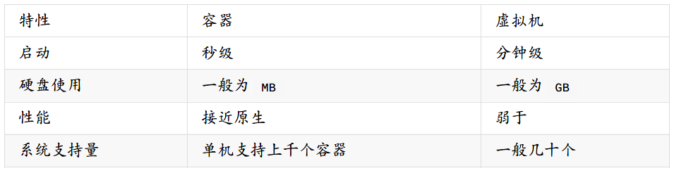

由于本人才疏学浅，这里便再节选一些原文中话具体描述Docker强大所在。<u>个人感觉在入门完Docker再回头重新认识一下下面所述的五个优势相关解释，会对Docker的认识有更深的理解。</u>

- **更高效的利用系统资源**：由于容器不需要进行硬件虚拟以及运行完整操作系统等额外开销，Docker 对系统资源的利用率更高。无论是应用执行速度、内存损耗或者文件存储速度，都要比传统虚拟机技术更高效。因此，相比虚拟机技术，一个相同配置的主机，往往可以运行更多数量的应用。
- **更快速的启动时间**：传统的虚拟机技术启动应用服务往往需要数分钟，而Docker 容器应用，由于直接运行于宿主内核，无需启动完整的操作系统，因此可以做到秒级、甚至毫秒级的启动时间。大大的节约了开发、测试、部署的时间。
- **一致的运行环境**：开发过程中一个常见的问题是环境一致性问题。由于开发环境、测试环境、生产环境不一致，导致有些bug 并未在开发过程中被发现。而Docker 的镜像提供了除内核外完整的运行时环境，确保了应用运行环境一致性，从而不会再出现「这段代码在我机器上没问题啊」这类问题。
- **持续交付和部署**：Docker是build once，run everywhere. 使用Docker 可以通过定制应用镜像来实现持续集成、持续交付、部署。开发人员可以通过Dockerfile 来进行镜像构建，并结合持续集成(Continuous Integration) 系统进行集成测试，而运维人员则可以直接在生产环境中快速部署该镜像，甚至结合持续部署(Continuous Delivery/Deployment) 系统进行自动部署。
- **更轻松的迁移**：Docker 使用的分层存储以及镜像的技术，使得应用重复部分的复用更为容易，也使得应用的维护更新更加简单，基于基础镜像进一步扩展镜像也变得非常简单。此外，Docker 团队同各个开源项目团队一起维护了一大批高质量的官方镜像，既可以直接在生产环境使用，又可以作为基础进一步定制，大大的降低了应用服务的镜像制作成本。使用Dockerfile 使镜像构建透明化，不仅仅开发团队可以理解应用运行环境，也方便运维团队理解应用运行所需条件，帮助更好的生产环境中部署该镜像。

## II. Docker中基本概念

### 镜像(Image)

<font color="#ff9900">镜像，从认识上简单的来说，就是面向对象中的类，相当于一个模板。</font>从本质上来说，镜像相当于一个文件系统。Docker 镜像是一个特殊的文件系统，除了提供容器运行时所需的程序、库、资源、配置等文件外，还包含了一些为运行时准备的一些配置参数（如匿名卷、环境变量、用户等）。镜像不包含任何动态数据，其内容在构建之后也不会被改变。

### 容器(Container)

<font color="#ff9900">容器，从认识上来说，就是类创建的实例，就是依据镜像这个模板创建出来的实体。</font>容器的实质是进程，但与直接在宿主执行的进程不同，容器进程运行于属于自己的独立的命名空间。因此容器可以拥有自己的root 文件系统、自己的网络配置、自己的进程空间，甚至自己的用户ID 空间。容器内的进程是运行在一个隔离的环境里，使用起来，就好像是在一个独立于宿主的系统下操作一样。这种特性使得容器封装的应用比直接在宿主运行更加安全。

### 仓库(Repository)

<font color="#ff9900">仓库，从认识上来说，就好像软件包上传下载站，有各种软件的不同版本被上传供用户下载。</font>镜像构建完成后，可以很容易的在当前宿主机上运行，但是，如果需要在其它服务器上使用这个镜像，我们就需要一个集中的存储、分发镜像的服务，Docker Registry 就是这样的服务。

### Docker版本

Docker 划分为CE 和EE。CE 即社区版（免费，支持周期三个月），EE 即企业版，强调安全，付费使用。Docker在1.13 版本之后，从2017年的3月1日开始，版本命名规则变为如下：

项目 | 说明
--- | ---
版本格式 | YY.MM
Stable版本 | 每个季度发行
Edge版本 | 每个月发型

Docker CE 每月发布一个Edge 版本(17.03, 17.04, 17.05…)，每三个月发布一个Stable 版本(17.03, 17.06, 17.09…)，Docker EE 和Stable 版本号保持一致，但每个版本提供一年维护。

### 分层存储

因为镜像包含操作系统完整的root 文件系统，其体积往往是庞大的，因此在Docker设计时，就充分利用Union FS 的技术，将其设计为分层存储的架构。所以严格来说，镜像并非是像一个ISO 那样的打包文件，镜像只是一个虚拟的概念，其实际体现并非由一个文件组成，而是由一组文件系统组成，或者说，由多层文件系统联合组成。

<font color="#ff9900">镜像构建时，会一层层构建，前一层是后一层的基础。每一层构建完就不会再发生改变，后一层上的任何改变只发生在自己这一层。</font>比如，删除前一层文件的操作，实际不是真的删除前一层的文件，而是仅在当前层标记为该文件已删除。在最终容器运行的时候，虽然不会看到这个文件，但是实际上该文件会一直跟随镜像。因此，在构建镜像的时候，需要额外小心，每一层尽量只包含该层需要添加的东西，<font color="#ff9900">任何额外的东西应该在该层构建结束前清理掉。</font>

分层存储的特征还使得镜像的复用、定制变的更为容易。甚至可以用之前构建好的镜像作为基础层，然后进一步添加新的层，以定制自己所需的内容，构建新的镜像。

## III. 安装Docker

### Win10

下载：<https://docs.docker.com/docker-for-windows/install/>

Docker支持64 位版本的Windows 10 Pro，且必须开启Hyper-V。开启方式为：打开“控制面板”->“程序”-> “启动或关闭Windows功能”，找到Hyper-V并勾选，确定重启电脑。


安装下载好的Docker for Windows Installer.exe，如下：

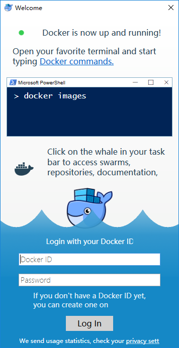

鉴于国内网络问题，后续拉取Docker镜像十分缓慢，需要配置国内镜像加速，在系统右下角托盘Docker 图标内右键菜单选择Settings，打开配置窗口后左侧导航菜单选择Daemon，在Registry mirrors 一栏中填写加速器地址 <https://registry.docker-cn.com> ，之后点击Apply保存后Docker就会重启并应用配置的镜像地址了。

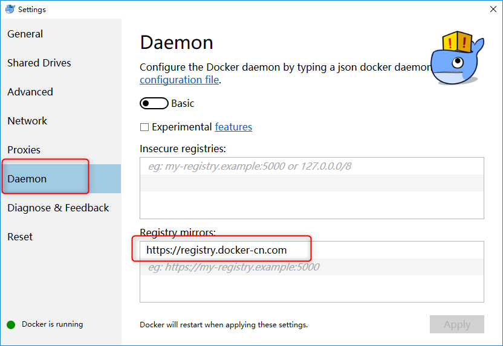

### Ubuntu16.04+

在Ubuntu系统中安装较为简单，官方提供了脚本供我们进行安装。

```bash
sudo apt install curl
curl -fsSL get.docker.com -o get-docker.sh
sudo sh get-docker.sh --mirror Aliyun
```

执行这个命令后，脚本就会自动的将一切准备工作做好，并且把Docker CE 的Edge版本安装在系统中。

#### 启动Docker CE

```bash
sudo systemctl enable docker
sudo systemctl start docker
```

#### 建立docker 用户组

默认情况下，docker 命令会使用Unix socket 与Docker 引擎通讯。而只有root 用户和docker 组的用户才可以访问Docker 引擎的Unix socket。出于安全考虑，一般Ubuntu系统上不会直接使用root 用户。因此，更好地做法是将需要使用docker 的用户加入docker用户组。

```bash
# 建立docker组
sudo groupadd docker
# 将当前用户加入docker组
sudo usermod -aG docker $USER
```

注销当前用户，重新登录Ubuntu，输入docker info，此时可以直接出现信息。

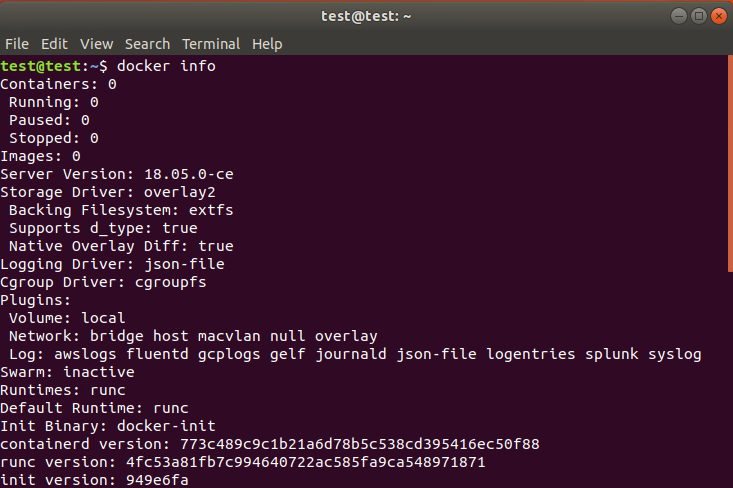

配置国内镜像加速

在 `/etc/docker/daemon.json` 中写入如下内容（如果文件不存在请新建该文件）

```json
{
    "registry-mirrors": [
        "https://registry.docker-cn.com"
    ]
}
```

重新启动服务

```bash
sudo systemctl daemon-reload
sudo systemctl restart docker
```

## IV. Docker的C/S模式

Docker 采用了C/S 架构，包括客户端和服务端。Docker 守护进程（Daemon）作为服务端接受来自客户端的请求，并处理这些请求（创建、运行、分发容器）。

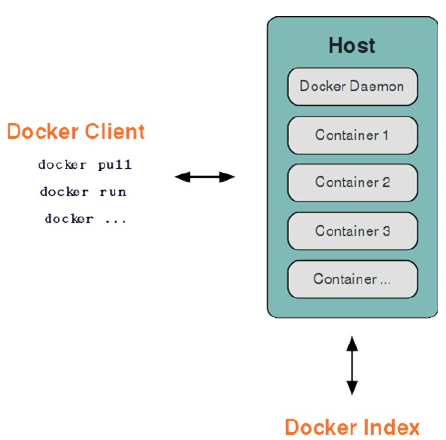

Docker 守护进程一般在宿主主机后台运行，等待接收来自客户端的消息；Docker 客户端则为用户提供一系列可执行命令，用户用这些命令实现跟Docker 守护进程交互。我们之前在Win10的命令行中便是最主要的客户端：

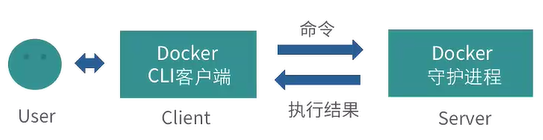

Docker也为我们提供了Remote API来操作Docker的守护进程，也意味着我们可以通过自己的程序来控制Docker的运行。客户端和服务端既可以运行在一个机器上，也可通过socket 或者RESTful API 来进行通信：

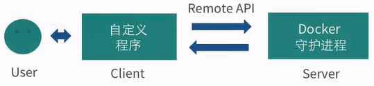

至于Docker的客户端与守护进程之间的通信，其连接方式为socket连接。主要有三种socket连接方式：

- unix:///var/run/docker.sock
- tcp://host:port
- fd://socketfd

完整的Docker的C/S连接方式的本质可以一般表示为如下：

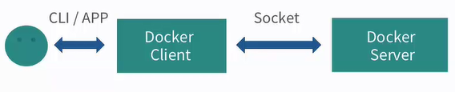

## V. 使用Docker

### 容器的基操

**启动一次操作容器**：`docker run IMAGE_NAME [COMMAND] [ARG…]`

例如，启动一个容器输出hello world。由于刚装上Docker，没有任何镜像，所以会先下载一个最新的ubuntu18.04的docker镜像。<font color="FF9900">一次操作容器在处理完操作后会立即关闭容器。</font>

    docker run ubuntu echo 'hello world'

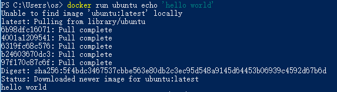

**启动交互式容器**：`docker run -t -i --name=自定义名称 IMAGE_NAME /bin/bash`

- -i –interactive=true | false，默认是false
- -t –tty=true | false，默认是false
- --name 给启动的容器自定义名称，方便后续的容器选择操作

启动交互式的容器，就是类似虚拟机、云主机的操作方式，操作完一个命令后仍然可以继续：

    docker run -i -t ubuntu /bin/bash

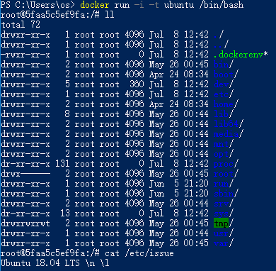

**查看容器**：`docker ps [-a] [-l]`

- 省略 列出正在运行的容器
- -a all 列出所有容器
- -l latest 列出最近的容器

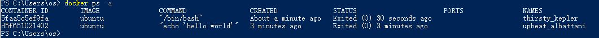

**查看指定容器**：`docker inspect name | id`

name指代具体的容器名称，id则是容器的唯一id标识。inspect命令可以详细的展示出容器的具体信息。

    docker inspect haha

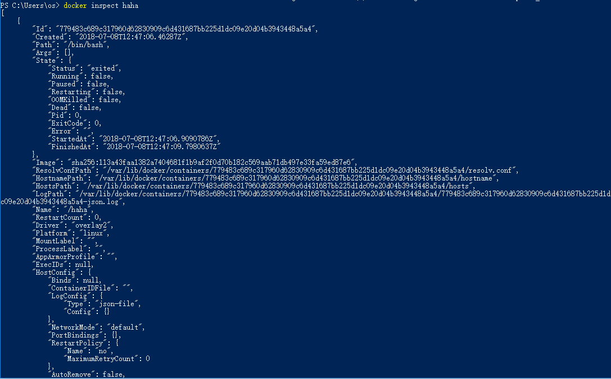

**重新启动停止的容器**：`docker start [-i] 容器名`

实际使用时，没必要每次都重新启动一个新的容器，我们可以重新启动之前创建的容器，现实情况也需要我们这样使用。

    docker start -i haha

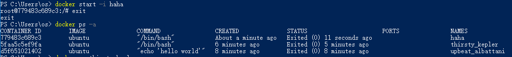

**删除停止的容器**：`docker rm name | id`

    docker rm thirsty_kepler
    docker rm upbeat_albattani

### 守护式容器

交互式容器在运行完命令退出后即停止，而实际中我们常常需要能够长时间运行，即使退出也能后台运行的容器，而守护式容器具备这一功能。守护式容器具有：

1. 能够长期运行；
2. 没有交互式会话；
3. 适合于运行应用程序和服务。

#### 以守护形式运行容器

我们执行完需要的操作退出容器时，不要使用exit退出，可以利用Ctrl+P Ctrl+Q代替，以守护式形式推出容器。

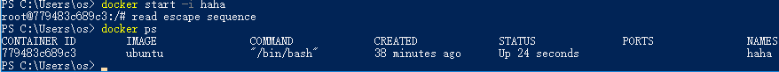

#### 附加到运行中的容器

退出正在运行的容器，想要再次进入，需要使用attach命令：`docker attach name | id`

    docker attach haha

#### 启动守护式容器

启动守护式容器，可以在后台为我们执行操作：`docker run -d IMAGE_NAME [COMMAND] [ARG…]`

<font color="#FF9900">当命令在后台执行完毕，容器还是会关闭。</font>这里防止容器立刻退出，写一个脚本循环输出“hello world”。

    docker run --name hiahia -d ubuntu /bin/sh -c "while true; do echo hello world; sleep 1; done"


#### 查看容器日志

当守护式容器在后台运行时，我们可以利用docker的日志命令查看其输出：`docker logs [-f] [-t] [–tail] IMAGE_NAME`

- -f –follows=true | false，默认是false，显示更新
- -t –timestamps=true | false，默认是false，显示时间戳
- –tail=“all” | 行数，显示最新行数的日志

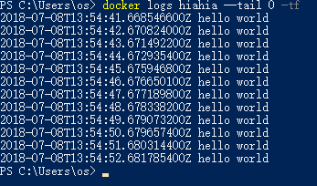

#### 查看容器内进程

对运行的容器查看其进程：`docker top IMAGE_NAME`

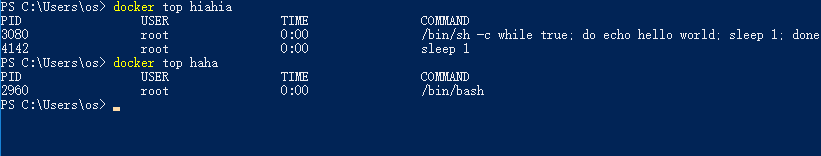

#### 运行中容器启动新进程

Docker的理念是一个容器运行一个服务，但是往往需要对一个服务进行监控，所以也需要在已经运行服务的容器启动新的进程：`docker exec [-d] [-i] [-t] IMAGE_NAME [COMMAND] [ARG…]`

    docker exec -i -t hiahia /bin/bash

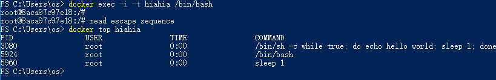

#### 停止守护式容器

发送信号停止容器：`docker stop 容器名`

强制停止：`docker kill 容器名`

## VI. 案例：在容器中部署静态网站

### 容器的端口映射

**命令**：`run [-P] [-p]`

- -P，–publish-all=true | false，大写的P表示为容器暴露的所有端口进行映射；
- -p，–publish=[]，小写的p表示为容器指定的端口进行映射，有四种形式：
    - `containerPort`：只指定容器的端口，宿主机端口随机映射；
    - `hostPort:containerPort`：同时指定容器与宿主机端口一一映射；
    - `ip::containerPort`：指定ip和容器的端口；
    - `ip:hostPort:containerPort`：指定ip、宿主机端口以及容器端口。

例如：

```bash
docker run -p 80 -i -t ubuntu /bin/bash
docker run -p 8080:80 -i -t ubuntu /bin/bash
docker run -p 0.0.0.0::80 -i -t ubuntu /bin/bash
docker run -p 0.0.0.0:8080:80 -i -t ubuntu /bin/bash
```

### 容器中部署Nginx服务

准备环境：

```bash
# 1. 创建映射80端口的交互式容器
docker run -p 80 --name web -i -t ubuntu /bin/bash
# 2. 更新源
apt-get update
# 3. 安装Nginx
apt-get install -y nginx
# 4. 安装Vim
apt-get install -y vim
```

创建静态页面：

```bash
mkdir -p /var/www/html
cd /var/www/html
vim index.html
```


修改Nginx配置文件:

```bash
# 查看Nginx安装位置
whereis nginx
# 修改配置文件
vim /etc/nginx/sites-enabled/default
```


运行Nginx:

```bash
# 启动nginx
nginx
# 查看进程
ps -ef
```

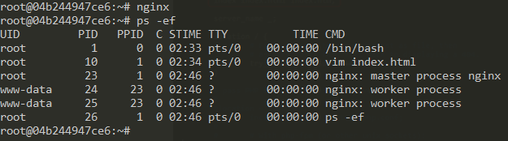

验证网站访问：

```bash
# 退出容器
# Ctrl+P Ctrl+Q
# 查看容器进程
docker top web
# 查看容器端口映射情况
docker port web
```

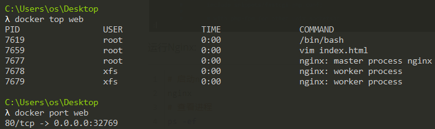

通过宿主机地址加映射端口访问：

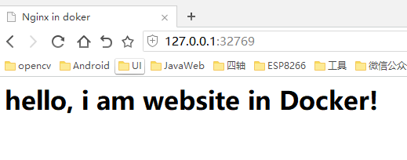

## VII. 镜像基操

### 查看删除镜像

**列出镜像**：`docker images [OPTIONS] [REPOSITORY]`

- -a，–all=false，显示所有镜像
- -f，–filter=[]，显示时过滤条件
- –no-trunc=false，指定不使用截断的形式显示数据
- -q，–quiet=false，只显示镜像的唯一id

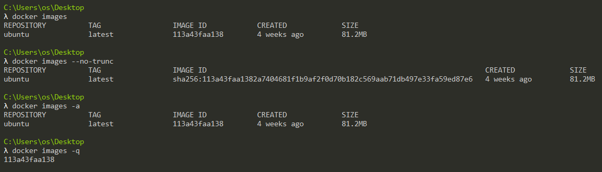

**查看镜像**：`docker inspect [OPTIONS] CONTAINER|IMAGE [CONTAINER|IMAGE]`

- -f，–format=""

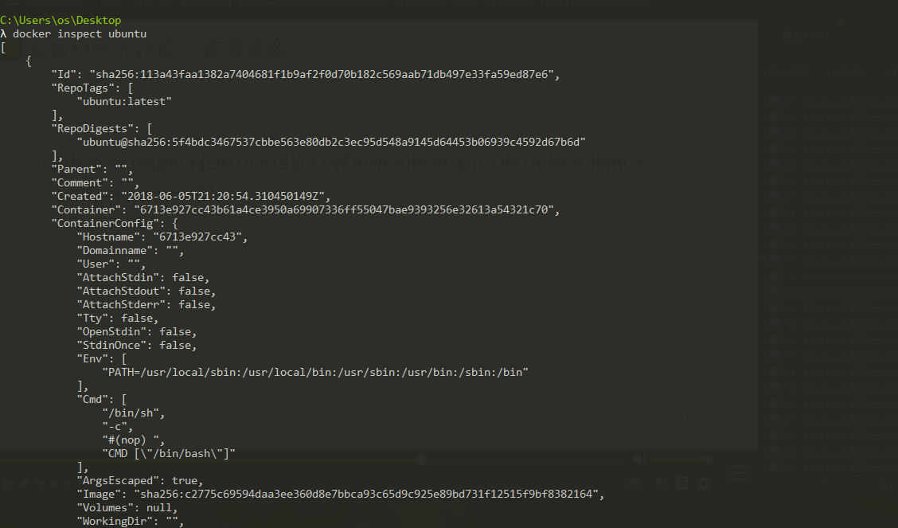

**删除镜像**：`docker rmi [OPTIONS] IMAGE [IMAGE]`

- -f，–force=false，强制删除镜像
- –no-prune=false，保留未打标签的父镜像

**虚悬镜像**：既没有仓库名，也没有标签，均为`\`

### 获取推送镜像

**查找镜像**：`docker search [OPTIONS] TEAM`

- –automated=false，仅显示自动化构建的镜像
- –no-trunc=false，不以截断的方式输出
- –filter，添加过滤条件

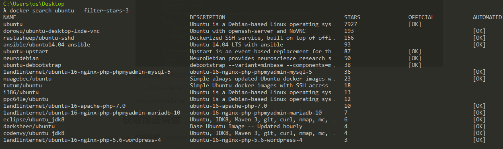

**拉取镜像**：`docker pull [OPTIONS] NAME [:TAG]`

- -a，–all-tags=false，下载所有的镜像（包含所有TAG）

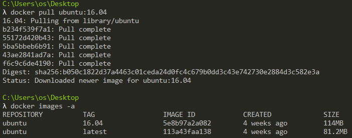

**推送镜像**：docker push NAME [:TAG]

Docker允许上传我们自己构建的镜像，需要注册DockerHub的账户。也可以上传到阿里云，地址：<https://cr.console.aliyun.com/#/namespace/index>

### 构建镜像

构建Docker镜像，可以保存对容器的修改，并且再次使用。构建镜像提供了自定义镜像的能力，以软件的形式打包并分发服务及其运行环境。Docker中提供了两种方式来构建镜像：

- 通过容器构建：`docker commit`
- 通过Dockerfile：`docker build`

#### 使用commit命令构建镜像

命令：`docker commit [OPTIONS] CONTAINER [REPOSITORY[:TAG]]`

参数：

- -a，–author=""，指定镜像的作者信息
- -m，–message=""，提交信息
- -p，–pause=true，commit时是否暂停容器

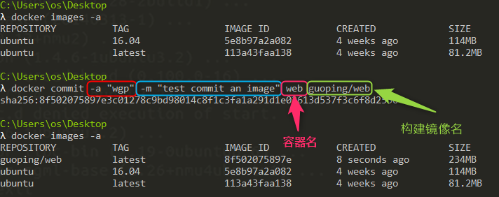

#### 使用Dockerfile文件构建镜像

Docker允许我们利用一个类似配置文件的形式来进行构建自定义镜像，在文件中可以指定原始的镜像，自定义镜像的维护人信息，对原始镜像采取的操作以及暴露的端口等信息。比如：

```dockerfile
# Sample Dockerfile
FROM ubuntu:16.04
MAINTAINER wgp "Kingdompin@163.com"
RUN apt-get update
RUN apt-get install -y nginx
EXPOSE 80
```

命令：`docker build [OPTIONS] DockerFile_PATH | URL | -`

参数：

- –force-rm=false
- –no-cache=false
- –pull=false
- -q，quite=false，构建时不输出信息
- –rm=true
- -t，tag=""，指定输出的镜像名称信息

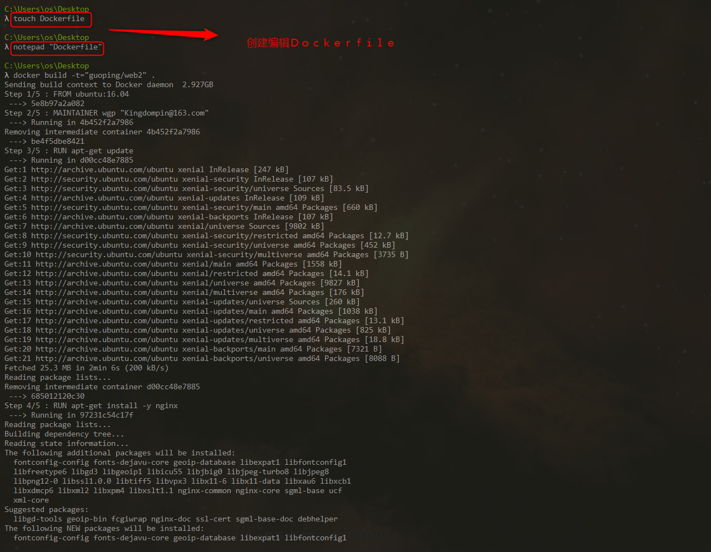

## VIII. 镜像迁移

我们制作好的镜像，一般会迁移或分享给其他需要的人。Docker提供了几种将我们的镜像迁移、分享给其他人的方式。推荐镜像迁移应该直接使用Docker Registry，无论是直接使用Docker Hub还是使用内网私有Registry都可以。使用镜像频率不高，镜像数量不多的情况下，我们可以选择以下两种方式。

### 上传Docker Hub

首先，需要在Docker Hub上申请注册一个帐号（人机验证时需要科学上网）。然后我们需要创建仓库，指定仓库名称。

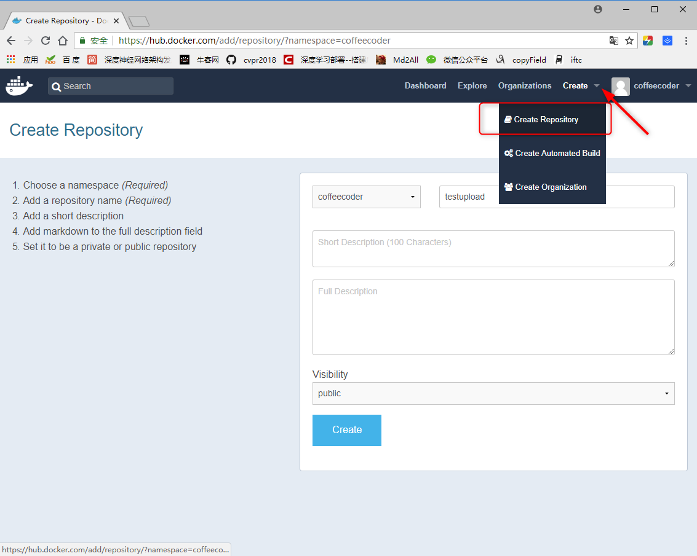

在终端中登录你的Docker Hub账户，输入docker login，输入用户名密码即可登录成功。

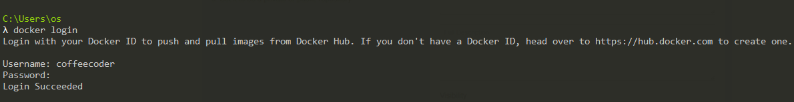

查看需要上传的镜像，并将选择的镜像打上标签，标签名需和Docker Hub上新建的仓库名称一致，否则上传失败。给镜像打标签的命令如下。

    docker tag <existing-image> <hub-user>/<repo-name>[:<tag>]

其中existing-image代表本地待上传的镜像名加tag，后面`<hub-user>/<repo-name>[:<tag>]`则是为上传更改的标签名，tag不指定则为latest。

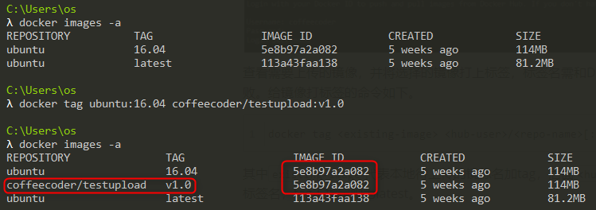

可以看到，我们重新为ubuntu:16.04的镜像打上标签，观察IMAGE ID可知，<font color="FF9900">同一镜像可以拥有不同的标签名。</font>接下来，我们利用push命令直接上传镜像。

    docker push <hub-user>/<repo-name>:<tag>

如图，我们已经上传成功。由于之前介绍的分层存储系统，我们这里是直接对已有的ubuntu镜像进行上传，只是重新打了标签，所以真正上传的只是变化的部分。

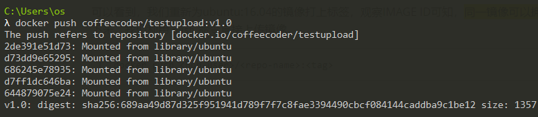

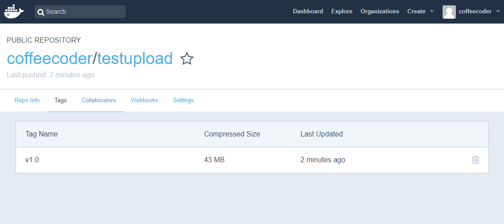

### 导出文件互传

Docker 还提供了 `docker load` 和 `docker save` 命令，用以将镜像保存为一个tar文件。比如这次我们将ubuntu:latest这个镜像保存为tar文件。

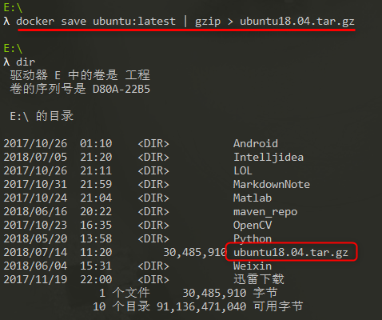

查看本地磁盘，即可看见名为ubuntu18.04的tar包。我们可以将其拷贝给其他PC，利用load命令重新导入。

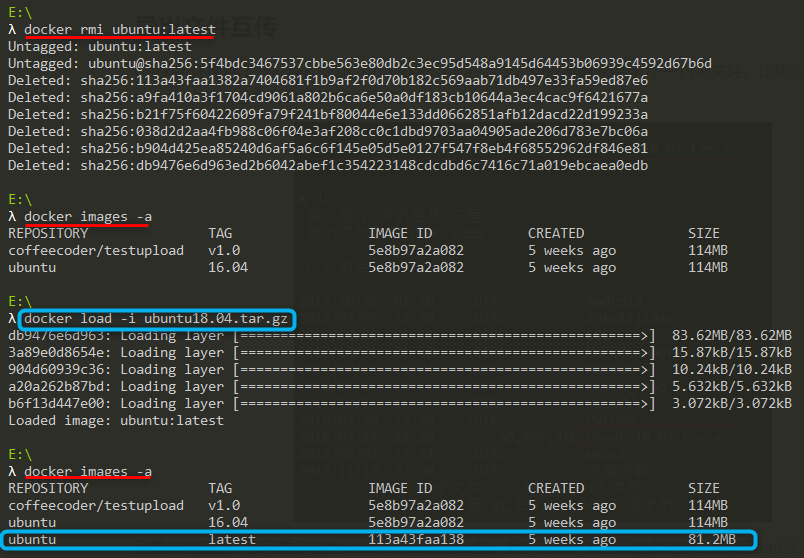

## 推荐阅读

- [从 0 开始了解 Docker](https://juejin.im/post/5ad3172c5188257ddb10109a)
- [如何把 Java Web 应用放在 docker 容器中运行](https://juejin.im/post/5851ebec61ff4b0068414319)
- [使用 Docker 搭建前端 Java 开发环境](https://segmentfault.com/a/1190000006843830)

---
via: https://blog.csdn.net/bskfnvjtlyzmv867/article/details/81044217
