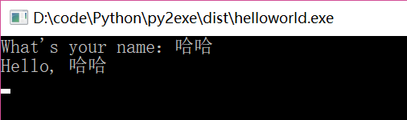
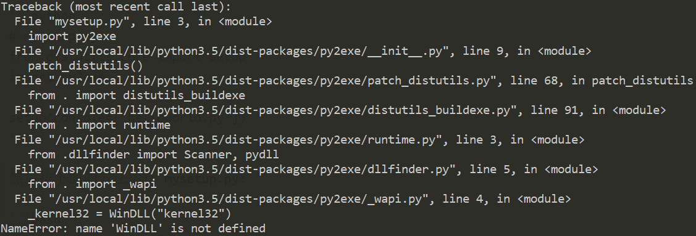
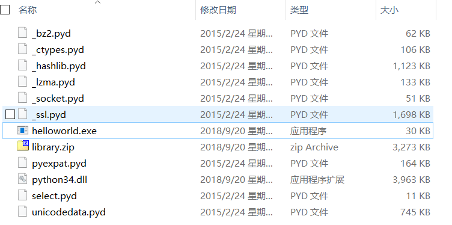

# 使用py2exe打包Python程序

上回在《[使用 PyInstaller 打包 Python 程序](使用PyInstaller打包Python程序.md)》中，我们介绍了使用 PyInstaller 对 Python 程序进行打包，今天带大家认识一个新的工具：py2exe。

接下来将从这几个方面进行介绍：基本使用方法、高级参数、注意点等。

## 简介 & 安装

py2exe 是一个将 python 脚本转换成 Windows 上的可独立执行的可执行程序（*.exe）的工具，这样，你就可以不用装 python 而在 Windows 系统上运行这个可执行程序。

### 安装

```bash
pip install py2exe
# 或者
python -m pip install py2exe
```

## 基本用法

看一个简单的例子：先写一个简单的脚本，文件名：`helloworld.py`：

```python
#!/usr/bin/env python
# -*- coding: utf-8 -*-

def say_hello(name):
    print("Hello, " + name)

if __name__ == "__main__":
    name = input("What's your name：")
    say_hello(name)
```

下面还需要个用于发布程序的设置脚本：`mysetup.py`，在其中的 setup 函数前插入语句 `import py2exe`。

```python
from distutils.core import setup
import py2exe

setup(console=["helloworld.py"])
```

然后按下面的方法运行 `mysetup.py`:

    python mysetup.py py2exe

运行生成的文件：



> 需要注意，这里需要在 Windows 环境下运行！否则可能会出现以下异常：



上面的命令执行后将产生一个名为 dist 的子目录，其中包含了 helloworld.exe、python24.dll、library.zip 等等文件：



dist 子目录中的文件包含了程序所必须的东西，你需要将该目录中的所有内容一起发布。

默认情况下，py2exe 会在 dist 下创建以下这些文件：

1. 一个或多个 exe 文件；
2. 几个 .pyd 文件，它们是已编译的扩展名，是 exe 文件所需要的；
3. python**.dll，加上其它的 .dll 文件，这些 .dll 是 .pyd 所需要的；
4. 一个 library.zip 文件，它包含了已编译的纯的 python 模块如 .pyc 或 .pyo。

## 扩展

### setup 优化

我们可以看到生成的 dist 目录中文件很多，那么是不是可以进行优化呢？

```python
# mysetup.py
# from distutils.core import setup
# import py2exe

# setup(console=["helloworld.py"])

# -*- encoding:utf-8 -*-

from distutils.core import setup
import py2exe

INCLUDES = []

options = {
    "py2exe" :
        {
            "compressed" : 1, # 压缩
            "optimize" : 2,
            "bundle_files" : 1, # 所有文件打包成一个 exe 文件
            "includes" : INCLUDES,
            "dll_excludes" : ["MSVCR100.dll"]
        }
}

setup(
    options=options,
    description = "this is a py2exe test",
    zipfile=None,
    console = [{"script":'helloworld.py'}])
```

options 可以用来指定一些编译的参数，譬如是否压缩，是否打包为一个文件等。

再次运行后，发现所有内容打包进了一个 helloworld.exe 程序中。

### 指定额外的文件

一些应用程序在运行时需要额外的文件，诸如配置文件、字体、图标。py2exe 并不会自动把他们打包到 dist 目录，不过可以通过配置参数来打包。

可以在安装脚本中用 `data_files` 可选项指定了那些额外的文件，那么 py2exe 能将这些文件拷贝到 dist 子目录中。

格式如下：`data_files=[("目的文件夹",["文件名",]), ("目的文件夹",["文件名",]), ("目的文件夹",["文件名",]),]`。

比如，我们的程序中有一个名为 images 的目录放置了程序需要的图片，

那么我们就需要在 setup 函数中配置参数 data_files，这个参数包含一个元组列表 `(target_dir,files)`，其中 target_dir 是指定文件存放的目标路径，files 是这些额外文件的一个列表。

示例如下：

```python
from distutils.core import setup
import py2exe

setup(

    windows = ['hello.py],
    data_files = [('images',['images\*.jpg'])]
    )
```

上面的示例中，会把 images 目录中所有的 jpg 文件打包到 dist/images 子目录中。

## 注意点

1、py2exe 新版本只支持 python3.3 以上，可以使用 pip install py2exe_py2 来安装兼容 python2 版本；
2、若在 python3.6 版本下运行报错，请切换到 python3.4 尝试；
3、python3 如果是 64 位，生成的 exe 只能在 64 位操作系统下运行，使用 32 位 python 可以解决；

4、从 Python 3.3，Windows 在构建 Python 时使用的是 Visual Studio 2010，因此生成后，需要手动将 msvcr100.dll 拷到生成目录下（dist目录），否则最终的文件运行时可能会报错；

或者通过 `data_files=[("",["MSVCR100.dll"])],` 打包其中；

比如，我在 Win10 下打的包，拷贝到 Win7 上，运行出错：


出现类似确实 dll 文件的情况，都可以参考这种方法进行解决。

## 总结

对于 pyinstaller 和 py2exe 两种把 Python 文件打包成 exe 的可执行文件的方法，都有各自的优缺点。但是最终目的都是为了在没有 Python 环境下的普通 Windows 系统的电脑中可直接运行，这点还是很不错的。

大家根据自己的需要，择优选择就行了。

---

参考：

1. <http://irootlee.com/Py2exe/>
2. <https://www.jianshu.com/p/afc56b647866>

---
via: https://blog.csdn.net/bruce_6/article/details/82906444
